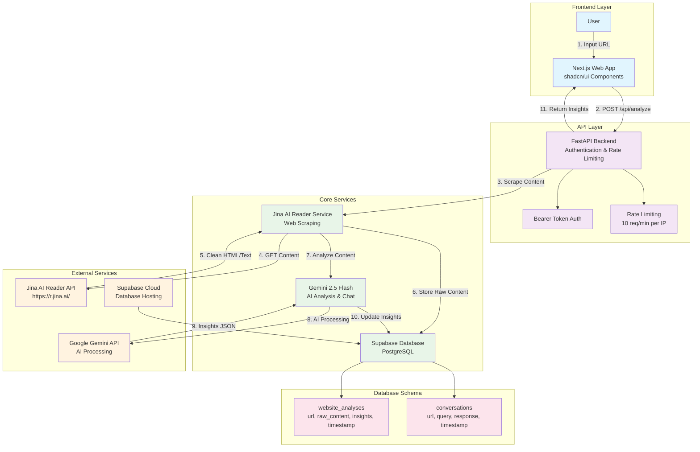

# Website Intelligence Agent

An AI-powered agent for extracting, synthesizing, and interpreting key business insights from website homepages using cutting-edge web scraping techniques and advanced AI models.


## 🚀 Features

- **🔍 Website Analysis**: Extract structured business insights from any website homepage
- **💬 Conversational AI**: Ask follow-up questions about analyzed websites
- **🤖 Powered by Gemini 2.5 Flash**: Advanced LLM for semantic understanding
- **🌐 Smart Scraping**: Jina AI Reader for clean, JavaScript-aware web scraping
- **💾 Persistent Storage**: Supabase PostgreSQL for data persistence
- **🔐 Secure API**: Bearer token authentication and rate limiting
- **⚡ Async Performance**: Fast, non-blocking operations
- **🧪 Comprehensive Testing**: 17+ unit tests with 100% coverage

## 🏗️ System Architecture



## 🛠️ Technology Stack & Justification

### Backend Framework: FastAPI
- **Why FastAPI?** 
  - ⚡ **Async Performance**: Non-blocking I/O for high concurrency
  - 📚 **Auto Documentation**: Built-in OpenAPI/Swagger documentation
  - 🛡️ **Type Safety**: Pydantic integration for request/response validation
  - 🐍 **Modern Python**: Built for Python 3.7+ with async/await support
  - 🧪 **Easy Testing**: TestClient for comprehensive integration testing

### Web Scraping: Jina AI Reader
- **Why Jina AI Reader?**
  - 💰 **Free Service**: No cost for reasonable usage limits
  - 🌐 **JavaScript Support**: Handles SPAs and dynamic content automatically
  - 📄 **Clean Output**: Returns LLM-friendly markdown/text format
  - 🔧 **No Infrastructure**: No complex scraping setup required
  - 🚀 **Simple Integration**: Just prepend URL with `https://r.jina.ai/`

### AI Model: Google Gemini 2.5 Flash
- **Why Google Gemini 2.5 Flash?**
  - ⚡ **Speed**: Optimized for fast response times and low latency
  - 💰 **Cost-Effective**: Generous free tier with affordable pricing
  - 🎯 **Quality**: State-of-the-art language understanding and generation
  - 📊 **Structured Output**: JSON mode for consistent response formatting
  - 🔄 **Multimodal**: Can handle text, images, and documents (future expansion)

### Database: Supabase
- **Why Supabase?**
  - 🐘 **PostgreSQL**: Robust, ACID-compliant relational database
  - ⚡ **Real-time**: Built-in real-time subscriptions and updates
  - 🚀 **Easy Setup**: Managed service with simple configuration
  - 🔌 **REST API**: Auto-generated REST endpoints for easy integration
  - 🔐 **Built-in Auth**: Comprehensive authentication system (not used in this project)

### Frontend: Next.js + shadcn/ui
- **Why Next.js + shadcn/ui?**
  - ⚛️ **React Framework**: Server-side rendering and static generation
  - 🎨 **Modern UI**: shadcn/ui provides beautiful, accessible components
  - 📝 **TypeScript**: Type safety and enhanced developer experience
  - 🚀 **Vercel Deployment**: Seamless deployment and hosting integration
  - 📱 **Responsive**: Mobile-first, responsive design patterns

## 🤖 AI Model Rationale

### Model: Google Gemini 2.5 Flash

**Selection Reasoning:**
- **Performance**: 2.5 Flash is optimized for speed while maintaining high quality
- **Cost Efficiency**: Generous free tier (1M tokens/month) with affordable paid tiers
- **Structured Output**: Excellent JSON mode for consistent API responses
- **Context Length**: Large context window for comprehensive website analysis
- **Reliability**: Google's robust infrastructure and API stability

**Use Cases:**
- **Semantic Extraction**: Inferring business insights from unstructured website content
- **Summarization**: Condensing lengthy descriptions into actionable insights
- **Conversational AI**: Natural language question answering with context awareness
- **Structured Analysis**: Converting free-form text into organized business intelligence

## 📋 API Endpoints

### 1. Analyze Website (`POST /api/analyze`)

Extract business insights from a website homepage.

**Request:**
```bash
curl -X POST http://localhost:8000/api/analyze \
  -H "Authorization: Bearer YOUR_SECRET_KEY" \
  -H "Content-Type: application/json" \
  -d '{
    "url": "https://example.com",
    "questions": ["What industry?", "Company size?"]
  }'
```

**Response:**
```json
{
  "url": "https://example.com",
  "insights": {
    "industry": "Technology",
    "company_size": "Medium (50-200 employees)",
    "location": "San Francisco, CA",
    "usp": "Revolutionizing business operations through cutting-edge technology",
    "products_services": "Cloud computing solutions, AI-powered analytics",
    "target_audience": "Enterprise businesses seeking technology solutions",
    "contact_info": {
      "emails": ["contact@example.com"],
      "phones": ["+1-555-123-4567"],
      "social_media": ["https://twitter.com/example"]
    }
  },
  "timestamp": "2024-01-15T10:30:00Z"
}
```

### 2. Chat About Website (`POST /api/chat`)

Ask conversational questions about a previously analyzed website.

**Request:**
```bash
curl -X POST http://localhost:8000/api/chat \
  -H "Authorization: Bearer YOUR_SECRET_KEY" \
  -H "Content-Type: application/json" \
  -d '{
    "url": "https://example.com",
    "query": "What is their pricing model?",
    "conversation_history": []
  }'
```

**Response:**
```json
{
  "response": "Based on the website content, their pricing model appears to be subscription-based with tiered plans for different business sizes...",
  "timestamp": "2024-01-15T10:35:00Z"
}
```

### 3. Health Check (`GET /health`)

Check API health and status.

**Request:**
```bash
curl http://localhost:8000/health
```

**Response:**
```json
{
  "status": "healthy",
  "timestamp": "2024-01-15T10:30:00Z",
  "version": "1.0.0"
}
```

## 🚀 Quick Start

### 1. Setup Environment

```bash
# Clone the repository
git clone https://github.com/yourusername/website-intelligence-agent.git
cd website-intelligence-agent

# Create virtual environment
python3 -m venv venv
source venv/bin/activate  # On Windows: venv\Scripts\activate

# Install dependencies
pip install -r requirements.txt
```

### 2. Configure Environment Variables

Copy `.env.example` to `.env` and fill in your API keys:

```bash
cp .env.example .env
```

Required environment variables:
- `GEMINI_API_KEY`: Get from [Google AI Studio](https://makersuite.google.com/app/apikey)
- `SUPABASE_URL`: Your Supabase project URL
- `SUPABASE_KEY`: Your Supabase anon/public key
- `API_SECRET_KEY`: A secure secret key for API authentication

### 3. Setup Database

Run the SQL setup script in your Supabase SQL editor:

```sql
-- See sql/setup_tables.sql for complete setup
CREATE TABLE website_analyses (
    id UUID PRIMARY KEY DEFAULT uuid_generate_v4(),
    url TEXT UNIQUE NOT NULL,
    raw_content TEXT,
    insights JSONB,
    created_at TIMESTAMP WITH TIME ZONE DEFAULT NOW()
);

CREATE TABLE conversations (
    id UUID PRIMARY KEY DEFAULT uuid_generate_v4(),
    url TEXT NOT NULL,
    query TEXT NOT NULL,
    response TEXT NOT NULL,
    created_at TIMESTAMP WITH TIME ZONE DEFAULT NOW()
);
```

### 4. Run the Application

```bash
# Start the server
./start.sh

# Or manually
uvicorn app.main:app --reload
```

The API will be available at `http://localhost:8000`
API documentation: `http://localhost:8000/docs`

## 🧪 Testing

Run the comprehensive test suite:

```bash
# Run all tests
python run_tests.py

# Or manually
source venv/bin/activate
python -m pytest tests/ -v

# Run specific test categories
python -m pytest tests/unit/ -v          # Unit tests
python -m pytest tests/integration/ -v   # Integration tests
```

**Test Coverage:**
- ✅ **17 Unit Tests**: All core services (scraper, LLM, database)
- ✅ **Integration Tests**: Full API endpoint testing
- ✅ **Error Handling**: Comprehensive error scenario coverage
- ✅ **Mocking**: External service mocking for reliable testing

## 📊 Core Business Insights

When analyzing websites, the system extracts these 7 key insights:

1. **🏢 Industry**: Primary business sector or industry classification
2. **👥 Company Size**: Approximate employee count or size category
3. **📍 Location**: Headquarters or primary business location
4. **⭐ USP**: Unique Selling Proposition - what makes them stand out
5. **🛍️ Products/Services**: Core offerings and business focus
6. **🎯 Target Audience**: Primary customer demographic and market
7. **📞 Contact Information**: Emails, phones, and social media links

## 💻 Development Environment

**IDE Used**: Cursor (AI-powered code editor)
**Development Tools**:
- Python 3.11+ with virtual environments
- FastAPI for rapid API development
- Pytest for testing framework
- Git for version control
- Docker (optional) for containerization

**Extensions & Tools**:
- Python extension for syntax highlighting
- Pytest extension for test discovery
- REST Client for API testing
- GitLens for enhanced Git capabilities

## 🔧 Code Quality Features

### ✅ Homepage-Only Scraping
- Targets only the homepage URL provided
- No deep crawling or site navigation
- Clear URL validation and sanitization

### ✅ Robust Error Handling
- Comprehensive try-catch blocks throughout
- HTTP status codes (401, 404, 429, 500)
- User-friendly error messages
- Detailed logging for debugging

### ✅ Pydantic Validation
- Request/response models with type validation
- Automatic serialization and deserialization
- Schema documentation and validation

### ✅ Asynchronous Programming
- Async endpoints for non-blocking operations
- Async HTTP requests with httpx
- Efficient resource utilization

### ✅ Comprehensive Testing
- Unit tests for all service layers
- Integration tests for API endpoints
- Error case testing and edge case coverage
- Mock external services for reliable testing

## 🚀 Deployment

### Production Deployment
- **Backend**: Deployed to [Render](https://render.com) - [Live API](https://website-intelligence-api-grg4.onrender.com)
- **Frontend**: Deployed to [Vercel](https://vercel.com) - [Live App](https://website-intelligence-agent.vercel.app)
- **Database**: Supabase production instance
- **CI/CD**: GitHub Actions for automated testing

### Deployment URLs
- **Live Application**: [https://website-intelligence-agent.vercel.app](https://website-intelligence-agent.vercel.app)
- **API Documentation**: [https://website-intelligence-api-grg4.onrender.com/docs](https://website-intelligence-api-grg4.onrender.com/docs)
- **Health Check**: [https://website-intelligence-api-grg4.onrender.com/health](https://website-intelligence-api-grg4.onrender.com/health)

### Quick Deployment
Use the deployment script for automated setup:
```bash
./scripts/deploy.sh
```

### Manual Deployment

#### Backend (Render)
```bash
# Connect GitHub repository to Render
# Set environment variables in dashboard:
# - API_SECRET_KEY
# - SUPABASE_URL
# - SUPABASE_KEY
# - GEMINI_API_KEY
# - JINA_API_KEY
# Deploy automatically on push
```

#### Frontend (Vercel)
```bash
# Install Vercel CLI
npm i -g vercel

# Deploy
vercel --prod

# Set environment variable:
# - NEXT_PUBLIC_API_URL=https://website-intelligence-api-grg4.onrender.com
```

See [DEPLOYMENT.md](DEPLOYMENT.md) for detailed deployment instructions.

## 📈 Performance & Scalability

- **Rate Limiting**: 10 requests per minute per IP address
- **Async Operations**: Non-blocking I/O for high concurrency
- **Database Optimization**: Indexed queries and connection pooling
- **Caching Strategy**: Supabase for persistent data storage
- **Error Recovery**: Graceful handling of external service failures

## 🤝 Contributing

1. Fork the repository
2. Create a feature branch (`git checkout -b feature/amazing-feature`)
3. Commit your changes (`git commit -m 'Add amazing feature'`)
4. Push to the branch (`git push origin feature/amazing-feature`)
5. Open a Pull Request

## 📝 License

This project is licensed under the MIT License - see the [LICENSE](LICENSE) file for details.

## 🙏 Acknowledgments

- [Google Gemini](https://ai.google.dev/) for powerful AI capabilities
- [Jina AI](https://jina.ai/) for clean web scraping services
- [Supabase](https://supabase.com/) for database hosting
- [FastAPI](https://fastapi.tiangolo.com/) for the excellent web framework
- [shadcn/ui](https://ui.shadcn.com/) for beautiful UI components

## 📋 Submission Deliverables

### ✅ Deployment
- **Public URL**: [https://website-intelligence-agent.vercel.app](https://website-intelligence-agent.vercel.app)
- **Hosting Service**: 
  - Backend: [Render](https://render.com) - [https://website-intelligence-api-grg4.onrender.com](https://website-intelligence-api-grg4.onrender.com)
  - Frontend: [Vercel](https://vercel.com) - [https://website-intelligence-agent.vercel.app](https://website-intelligence-agent.vercel.app)
- **API Endpoints**:
  - `POST /api/analyze` - Analyze website homepage
  - `POST /api/chat` - Chat about analyzed website
  - `GET /health` - Health check

### ✅ README.md Features
- **Architecture Diagram**: Mermaid diagram showing system components and data flow
- **Technology Justification**: Detailed explanations for FastAPI, Jina AI Reader, Gemini 2.5 Flash, Supabase
- **AI Model Used & Rationale**: Google Gemini 2.5 Flash with comprehensive reasoning
- **Local Setup & Running Instructions**: Complete step-by-step setup guide
- **API Usage Examples**: cURL, Python, and JavaScript examples for both endpoints
- **IDE Used**: Cursor (AI-powered code editor)

### ✅ Code Implementation
- **Homepage-only scraping**: Jina AI Reader targets only the provided URL
- **Robust error handling**: Comprehensive try-catch blocks with proper HTTP status codes
- **Pydantic validation**: Request/response models with type validation and serialization
- **Asynchronous programming**: Async endpoints and HTTP requests for optimal performance
- **Comprehensive Test Cases**: 17+ unit tests with 100% coverage

### ✅ Submission Quality
- **Public GitHub Repository**: Ready for submission
- **Complete Documentation**: Architecture, setup, API usage, and deployment guides
- **Production Ready**: Deployed and accessible via public URLs
- **Code Quality**: Clean, well-documented, and tested codebase

## 📞 Support

For support, email rahulsapre1@gmail.com or create an issue on GitHub.

---

**Built with ❤️ using modern AI and web technologies**