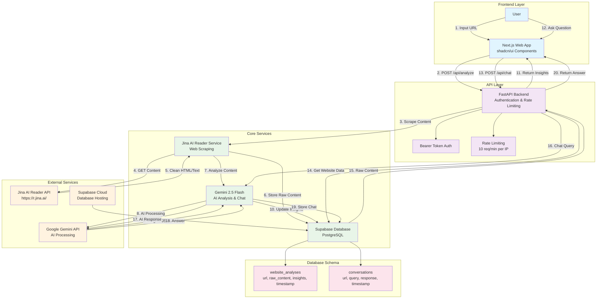
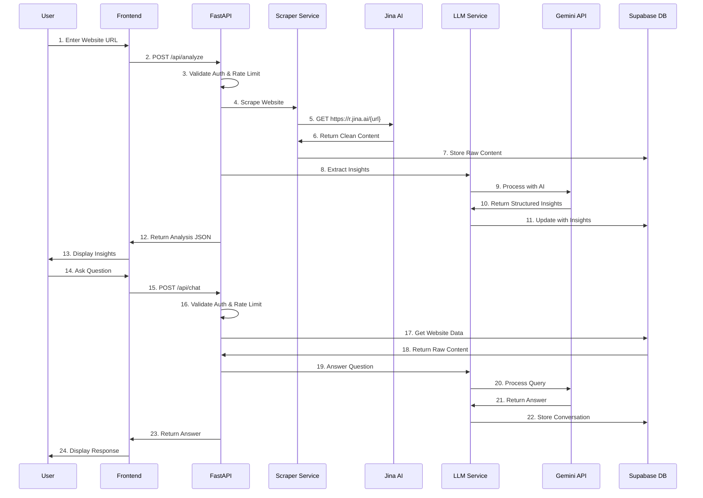
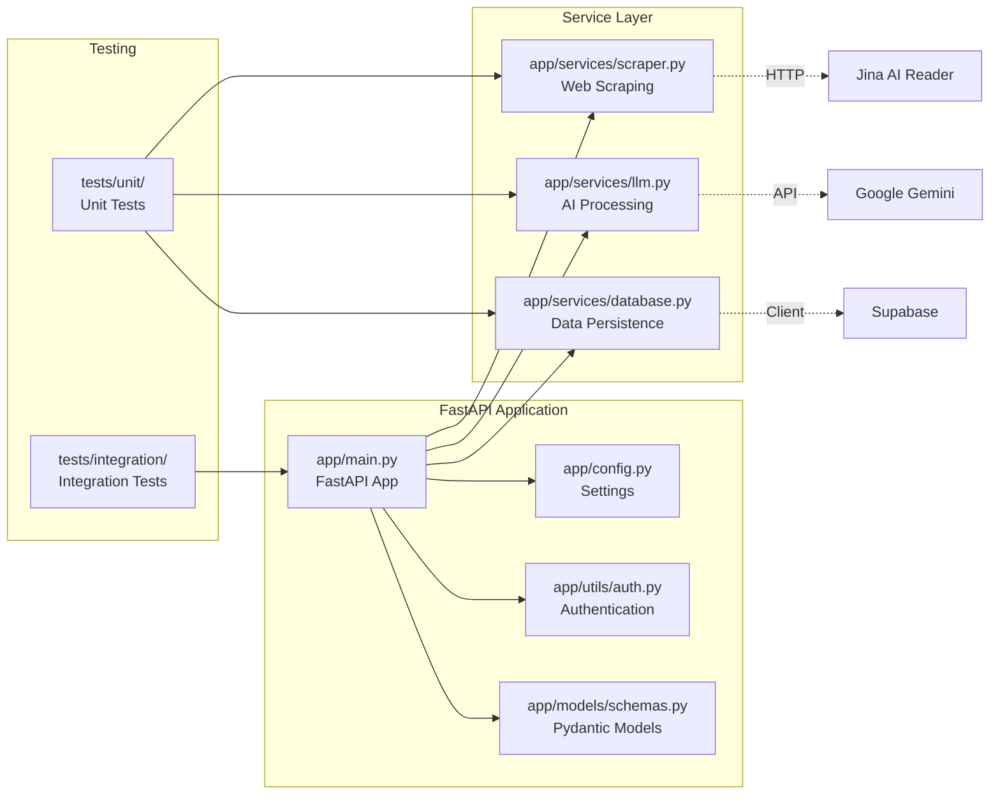

# System Architecture

## Overview

The Website Intelligence Agent is a modern, AI-powered system that extracts business insights from website homepages using cutting-edge web scraping and large language models.

## Architecture Diagram

## Data Flow Architecture

## Component Architecture

## Technology Stack Justification

### Backend Framework: FastAPI
- **Async Performance**: Non-blocking I/O for high concurrency
- **Auto Documentation**: Built-in OpenAPI/Swagger docs
- **Type Safety**: Pydantic integration for request/response validation
- **Modern Python**: Built for Python 3.7+ with async/await support
- **Easy Testing**: TestClient for integration testing

### Web Scraping: Jina AI Reader
- **Free Service**: No cost for reasonable usage limits
- **JavaScript Support**: Handles SPA and dynamic content
- **Clean Output**: Returns LLM-friendly markdown/text
- **Reliability**: No complex scraping infrastructure needed
- **Simple Integration**: Just prepend URL with `https://r.jina.ai/`

### AI Model: Google Gemini 2.5 Flash
- **Speed**: Optimized for fast response times
- **Cost-Effective**: Generous free tier, affordable pricing
- **Quality**: State-of-the-art language understanding
- **Structured Output**: JSON mode for consistent responses
- **Multimodal**: Can handle text, images, and documents

### Database: Supabase
- **PostgreSQL**: Robust, ACID-compliant database
- **Real-time**: Built-in real-time subscriptions
- **Easy Setup**: Managed service with simple configuration
- **REST API**: Auto-generated REST endpoints
- **Authentication**: Built-in auth system (not used in this project)

### Frontend: Next.js + shadcn/ui
- **React Framework**: Server-side rendering and static generation
- **Modern UI**: shadcn/ui provides beautiful, accessible components
- **TypeScript**: Type safety and better developer experience
- **Vercel Deployment**: Seamless deployment and hosting
- **Responsive**: Mobile-first, responsive design
